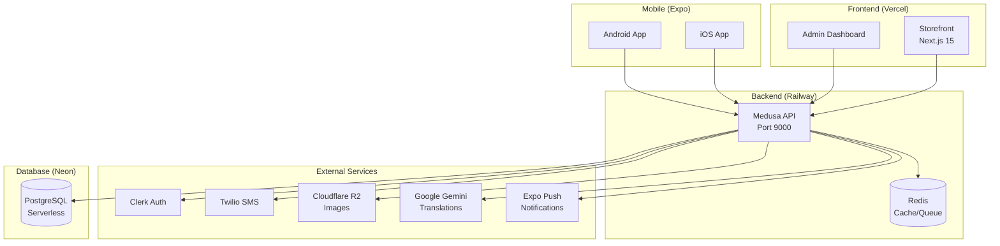
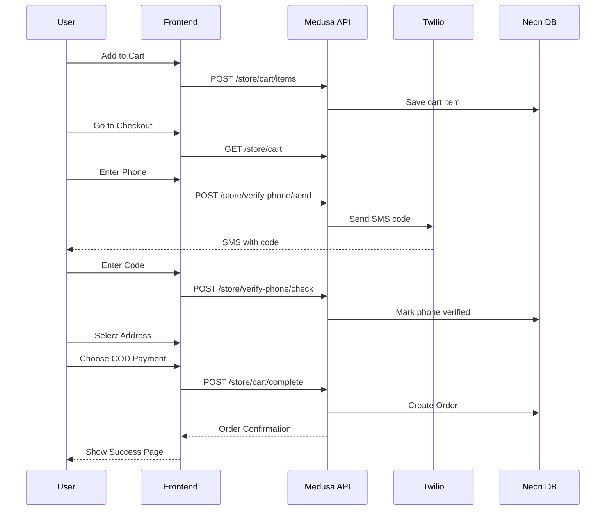
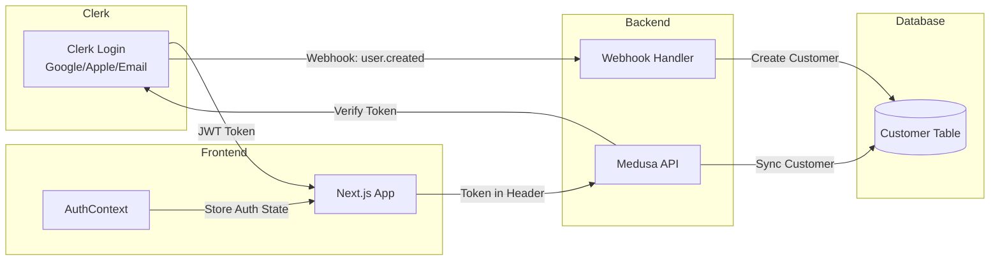
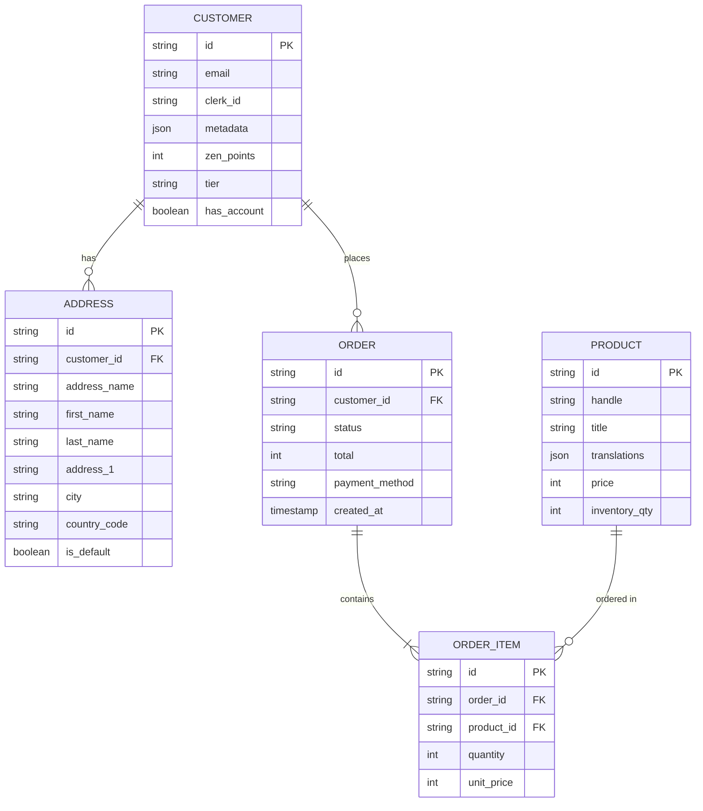
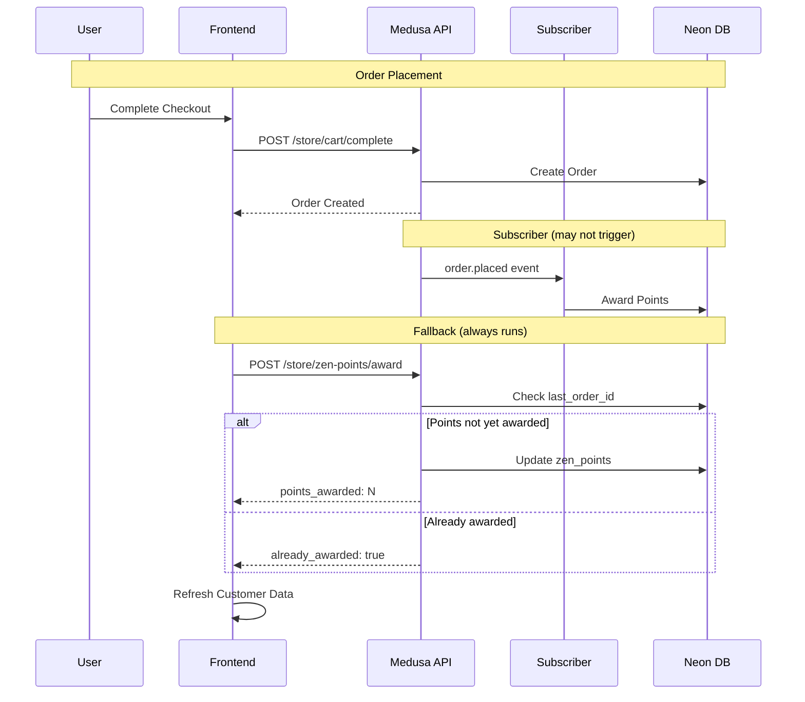
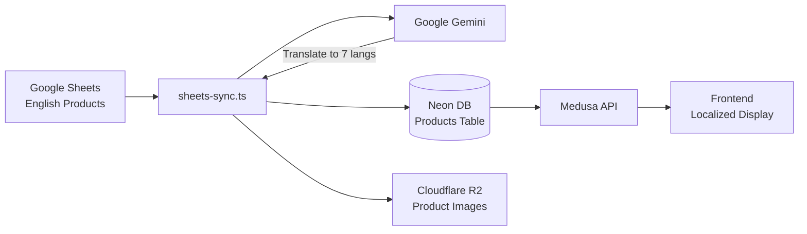
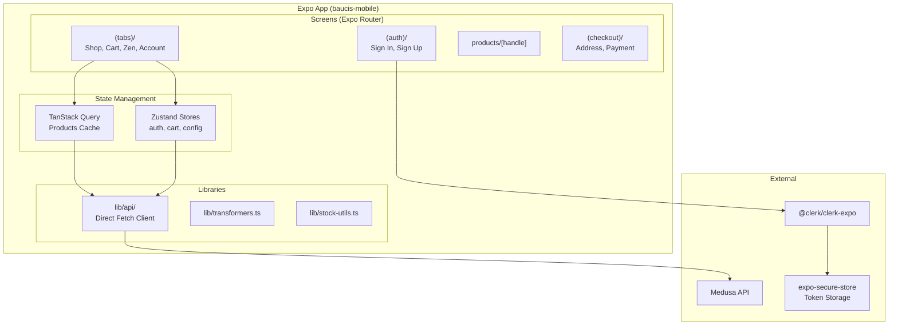
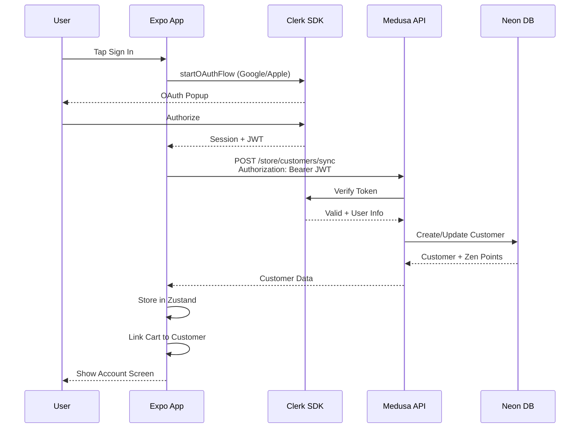
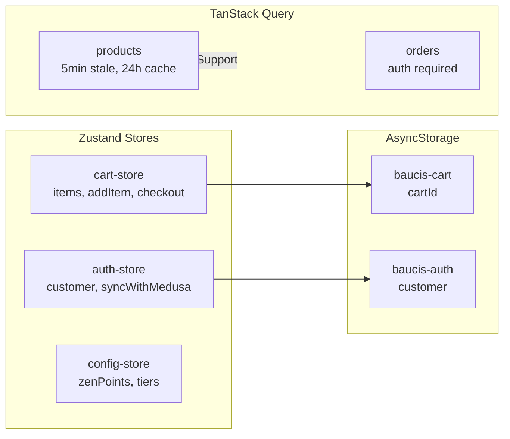

# Baucis Zen - Architecture Diagrams

## System Overview



## Checkout Flow



## Authentication Flow



## Data Model



## Zen Points System

```mermaid
flowchart TD
    subgraph Earning["Earning Points"]
        O[Order Placed] -->|Event| S[zen-points-award.ts]
        O -->|Fallback| API[/store/zen-points/award]
        S -->|+10 points per €1| P[Update Customer Points]
        API -->|+10 points per €1| P
        G[Memory Game Win] -->|+10 points daily| P
        A[Account Created] -->|+50 signup bonus| P
    end

    subgraph Tiers["Tier Discounts"]
        P --> T{Check Balance}
        T -->|0-99| Seed[Seed: 0%]
        T -->|100-249| Sprout[Sprout: 5%]
        T -->|250-499| Blossom[Blossom: 10%]
        T -->|500+| Lotus[Lotus: 15%]
    end

    subgraph Checkout["Discount Applied"]
        Tiers --> D[Apply % to Products]
        D --> |Shipping excluded| Total[Final Total]
    end

    subgraph Reset["Monthly Reset"]
        R[30-day Cycle] -->|Check activity| RS[zen-points-reset.ts]
        RS -->|Reset if inactive| P
    end
```

## Zen Points Award Flow



## Product Sync Flow



## Shipping Zones

```mermaid
flowchart TB
    subgraph Albania["Albania (AL)"]
        Z1[Zone 1: Tirana]
        Z2[Zone 2: Central]
        Z3[Zone 3: Remote]
    end

    subgraph Kosovo["Kosovo (XK)"]
        KS[Flat Rate]
    end

    Cart --> Calc[/store/shipping/calculate]
    Calc --> |Country = AL| Albania
    Calc --> |Country = XK| Kosovo
    Calc --> Rate[Calculate by Weight + Zone]
    Rate --> Display[Show in Checkout]
```

## Mobile App Architecture



## Mobile Authentication Flow



## Mobile State Architecture


